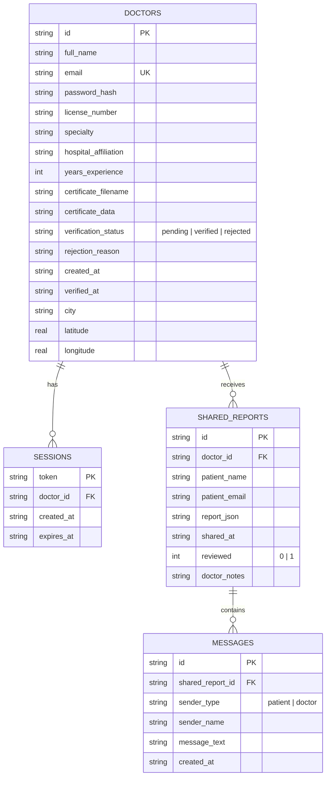

# 🧠 MindCare AI (MindAI-Final) — Comprehensive Project Context & Architecture Guide

> **Version:** 1.1.0-Production (OpenRouter Multi-Language Enhanced)  
> **Platform:** Next.js 14.2 (App Router), React 18, TypeScript, TailwindCSS  
> **Primary Purpose:** Evidence-Based Multimodal Mental Health Assessment, Explainable AI (SHAP), Digital Phenotyping, Multilingual Clinical Dialogue, and Doctor Telehealth Integration.

---

## 📋 Table of Contents
1. [Executive Overview & Real-World Problem](#1-executive-overview--real-world-problem)
2. [Key Innovations & Core Capabilities](#2-key-innovations--core-capabilities)
3. [System Architecture & Data Flow](#3-system-architecture--data-flow)
4. [The 4-Pillar Multimodal AI Assessment Engine](#4-the-4-pillar-multimodal-ai-assessment-engine)
5. [Multilingual Conversational Ecosystem (English, Hindi, Marathi)](#5-multilingual-conversational-ecosystem)
6. [Assessment Screen UI & Voice Experience](#6-assessment-screen-ui--voice-experience)
7. [Clinical Standardized Screeners (PHQ-9 & GAD-7)](#7-clinical-standardized-screeners)
8. [Explainable AI (XAI) & SHAP Risk Scoring](#8-explainable-ai-xai--shap-risk-scoring)
9. [Passive Digital Phenotyping (YouTube, Reddit, Instagram)](#9-passive-digital-phenotyping)
10. [Clinical Provider Portal & Telehealth System](#10-clinical-provider-portal--telehealth-system)
11. [Admin Verification System](#11-admin-verification-system)
12. [Crisis Safety Guardrails & Ethical AI](#12-crisis-safety-guardrails--ethical-ai)
13. [Database Schema & Architecture (SQLite)](#13-database-schema--architecture)
14. [Complete Folder & File Structure Walkthrough](#14-complete-folder--file-structure-walkthrough)
15. [Backend API Routes Reference](#15-backend-api-routes-reference)
16. [Environment Setup & Installation Guide](#16-environment-setup--installation-guide)

---

## 1. Executive Overview & Real-World Problem

### The Problem
Mental healthcare faces three massive challenges worldwide:
1. **Severe Stigma and Fear:** Individuals avoid seeking help early because of fear of judgment, societal stigma, or intimidation from clinical settings.
2. **Subjectivity of Traditional Diagnosis:** Standard checkups rely almost exclusively on retrospective paper surveys (e.g., "How have you felt over the last 14 days?"), which are vulnerable to recall bias, mood masking, and inaccurate self-reporting.
3. **Severe Shortage of Mental Health Professionals:** In many parts of the world (including India and rural regions), the ratio of psychiatrists/psychologists to patients is lower than 1 per 100,000 people.

### The Solution: MindCare AI
**MindCare AI** is an intelligent, compassionate, and privacy-preserving mental health platform. It acts as an **early-detection and objective screening companion** that bridges the gap between individuals and healthcare providers:
- It conducts a friendly, multimodal clinical conversation guided by an AI companion named **Sage**.
- It analyzes **speech tone**, **facial micro-expressions**, **linguistic word patterns**, and **validated questionnaires**.
- It provides **transparent, Explainable AI (SHAP)** reports that both patients and psychiatrists can trust.
- It directly connects patients to verified, nearby clinicians for immediate messaging and live video consultations.

---

## 2. Key Innovations & Core Capabilities

| Feature | Description | Tech Used |
| :--- | :--- | :--- |
| **Multimodal Perception** | Analyzes face, voice acoustics, and text sentiment simultaneously. | `face-api.js`, ONNX Runtime Web, Web Audio API |
| **Sub-Second Conversational AI** | Ultra-responsive conversational interviewer powered by **OpenRouter** (`openai/gpt-4o-mini`) with Groq fallback (`qwen/qwen3.8-27b`). | OpenRouter API, Groq Fallback |
| **Pure Multilingual Dialogue** | Native voice & text conversation in **English**, **Hindi (Devanagari)**, and **Marathi (Devanagari)** with instant acoustic voice matching. | Web Speech API, Native TTS synthesis, OpenRouter Prompts |
| **Interactive Assessment UI** | Inverted layout: Full chat window on the left, 4:3 compact webcam on the right, quick response chips, auto-send timer, and segmented language toggles. | React 18, Tailwind CSS, Framer Motion |
| **Evidence-Based Screeners** | Standardized medical screening using official PHQ-9 and GAD-7 rubrics with Question 9 auto-escalation. | Clinical psychometric algorithms |
| **Explainable AI (SHAP)** | Explains *why* a risk score was generated with itemized positive (+) and negative (-) feature impacts. | SHapley Additive exPlanations feature matrix |
| **Passive Digital Phenotyping** | Unobtrusively extracts circadian rhythm and sleep shift patterns from YouTube, Reddit, and Instagram data. | YouTube Data API v3, Reddit OAuth, OpenRouter / Gemini |
| **Doctor Telehealth & Messaging** | Clinician license verification, geolocation discovery (Haversine formula), encrypted report sharing, real-time messaging, and Jitsi video calls. | `better-sqlite3`, Haversine geolocation, Jitsi Meet API |
| **Zero-Cloud Video Privacy** | Face tracking and audio tone analysis run **100% client-side inside the browser**. Raw video and audio streams never leave the user's laptop. | In-browser WebAssembly & Web Workers |

---

## 3. System Architecture & Data Flow

```mermaid
flowchart TD
    subgraph Client ["Client Browser (Next.js 14 React)"]
        UI[User Interface / Companion State Machine]
        Webcam[Webcam Video Feed] --> FaceModel[face-api.js: Facial Emotion]
        Mic[Microphone Audio Feed] --> VoiceModel[Web Audio API: Acoustic Pitch & Amplitude]
        STT[Web Speech API: Speech-to-Text - en-IN / hi-IN / mr-IN] --> TextStream[User Response Text]
        SpeechSynth[Browser SpeechSynthesis: Native Regional Voice]
    end

    subgraph Backend ["Next.js Serverless API Routes (/app/api/*)"]
        API_Interview[/api/interview - Adaptive Interview Engine]
        API_Chat[/api/report-chat - Interactive Clinical Q&A]
        API_Social[/api/social/* - YouTube / Reddit / Instagram Analytics]
        API_Doctors[/api/doctors - Geolocation Clinician Matcher]
        API_Reports[/api/reports/* - Encrypted Report Sharing]
        API_Messages[/api/messages - Doctor-Patient Messaging]
        API_Admin[/api/admin/* - Doctor License Approval]
    end

    subgraph AI_Cloud ["High-Speed Cloud Inference"]
        OpenRouter[OpenRouter API Cloud: openai/gpt-4o-mini & qwen-2.5-72b]
        Groq[Groq API Cloud: Fallback qwen3.8-27b]
        Gemini[Google Gemini 2.5 Flash: Fallback Social Analysis]
    end

    subgraph Storage ["Persistent Database"]
        SQLite[(better-sqlite3: data/mindcare.sqlite)]
    end

    UI -->|Sends Turn History & Selected Language| API_Interview
    API_Interview -->|Low-Latency Multilingual Prompt| OpenRouter
    OpenRouter -.->|Fallback if unavailable| Groq
    OpenRouter -->|Conversational Reply in Devanagari + English Mood Tag| API_Interview
    API_Interview -->|Clean JSON Response| UI
    UI -->|Speaks Response Aloud in hi-IN / mr-IN / en-IN| SpeechSynth

    UI -->|Share Report with Doctor| API_Reports
    API_Reports --> SQLite

    UI -->|YouTube Token / Instagram Archive| API_Social
    API_Social --> OpenRouter
```

### Complete User Journey
1. **Splash & Welcome:** Patient is introduced to MindCare AI and Sage.
2. **Authentication & Consent:** Strict explicit consent checkboxes covering privacy policy, camera/audio processing, and non-medical disclaimer.
3. **Optional Social Connect:** Secure OAuth connection to YouTube or Reddit to analyze sleep timing and circadian rhythm changes.
4. **Multimodal Assessment:** An interactive 5-6 turn clinical dialogue where camera, microphone, and language are continuously monitored.
5. **Standardized Screener:** The patient completes PHQ-9 (Depression) and GAD-7 (Anxiety) standard questionnaires.
6. **Report & Explainable AI:** A comprehensive medical report is synthesized, presenting an overall well-being score, risk levels, and SHAP factor contributions.
7. **Doctor Connection & Telehealth:** The patient can find the nearest licensed therapist by distance, share their report securely, send direct messages, and join an encrypted Jitsi video consultation.

---

## 4. The 4-Pillar Multimodal AI Assessment Engine

The core assessment screen (`components/screens/AssessmentInterfaceScreen.tsx`) executes four simultaneous perception channels in real time:

### Pillar 1: Facial Micro-Expression Tracking
- **Engine:** `face-api.js` (TensorFlow.js WebAssembly backend).
- **Execution:** Runs **100% locally in the browser**.
- **Detection:** Continuously detects 68 facial landmarks and classifies 7 emotional probabilities at ~10-15 FPS:
  - `Neutral`, `Happy`, `Sad`, `Angry`, `Fearful`, `Disgusted`, `Surprised`.
- **Clinical Meaning:** Detects flat affect (loss of emotional expressiveness), persistent sadness, sudden eyebrow furrowing, or involuntary stress cues.

### Pillar 2: Vocal Acoustic Analysis
- **Engine:** Web Audio API & `wav2vec2` feature extractors (`hooks/useVoiceEmotion.ts`).
- **Features Captured:**
  - **RMS Energy / Amplitude:** Measures energy and volume fluctuations.
  - **Speech Rate & Hesitations:** Long silences, pauses, and speech velocity.
  - **Acoustic Jitter / Pitch Variability:** Flat, monotonous voices often correlate with depressive episodes; erratic, high-frequency tremors correlate with acute anxiety.

### Pillar 3: Linguistic Sentiment & Semantic Understanding
- **Engine:** In-browser sentiment scoring + LLM mood tagger.
- **Classification:** Evaluates whether spoken sentences reflect feelings of hopelessness, severe exhaustion, cognitive overload, or positive coping mechanisms.
- **Categories:** `Positive`, `Calm`, `Neutral`, `Mild Distress`, `High Distress`.

### Pillar 4: Adaptive Conversational Interviewer ("Sage")
- **Engine:** OpenRouter API running `openai/gpt-4o-mini` (with fallback to `qwen/qwen-2.5-72b-instruct` and Groq `qwen/qwen3.8-27b`).
- **Behavior:** Sage acts as a compassionate, non-judgmental clinical interviewer. Rather than reading a static list of questions, Sage **adapts each follow-up question based on what the user just said**, their detected facial emotion, and their vocal tone.
- **Speed:** Delivers complete natural language responses in **1 to 2 seconds**, creating a true real-time conversational flow.

---

## 5. Multilingual Conversational Ecosystem

MindCare AI is engineered with native support for multilingual users across India and global communities:

### Supported Languages
1. **English** (`en-IN` / `en-US`)
2. **Hindi** (`hi-IN`) — Spoken and written in authentic **Devanagari script** (e.g., *"नमस्ते, यहाँ आने के लिए शुक्रिया। बातचीत शुरू करने से पहले, क्या आप मुझे अपनी उम्र बता सकते हैं?"*).
3. **Marathi** (`mr-IN`) — Spoken and written in authentic **Devanagari script** (e.g., *"नमस्कार, इथे आल्याबद्दल धन्यवाद. संवाद सुरू करण्यापूर्वी, आपण आपले वय सांगू शकाल का?"*).

### Technical Implementation
- **Speech-to-Text (Input):** Implemented using browser `webkitSpeechRecognition` / `SpeechRecognition`. When the user switches languages in the UI, the recognition engine immediately updates its `.lang` attribute (`hi-IN`, `mr-IN`, or `en-IN`).
- **Hands-Free Speech Flow:** 
  - Automatically detects when the user finishes speaking using a **2.8-second pause countdown** accompanied by a 3-second buffer (total ~5.8s comfort buffer).
  - The transcribed text appears in an editable input box so the user can easily fix words or continue typing manually before sending.
- **Backend LLM Prompting:** When Hindi or Marathi is chosen, the backend prompt explicitly commands the OpenRouter LLM to reply strictly in that language in clean Devanagari script, while keeping clinical metadata (`mood_tag`) in English so analytical calculations never break.
- **Text-to-Speech (Output):** The native `window.speechSynthesis` API scans the user's operating system voices with an `onvoiceschanged` event listener, prioritizing native voices like `Google हिन्दी`, `Google मराठी`, `Microsoft Hemant`, or `Microsoft Kalpana` to speak with authentic Indian accents.

---

## 6. Assessment Screen UI & Voice Experience

The flagship assessment interface in `components/screens/AssessmentInterfaceScreen.tsx` was redesigned to provide an exceptional user experience:

### 1. Inverted Layout (Chat Priority)
- **Primary Center/Left Section:** Large clinical conversation window showing the real-time dialogue history, animated voice orb, live transcription stream, and quick response chips.
- **Right Sidebar:** Compact, fixed-aspect-ratio (4:3) webcam box displaying live video, detected emotion percentages, confidence meters, hardware mic/camera toggle buttons, and multilingual status. The webcam never expands or shifts when chat messages grow.

### 2. Prominent 3-Language Segmented Switcher
Located at the top header of the screen:
```
[ 🇬🇧 English ]   [ 🇮🇳 हिन्दी (Hindi) ]   [ 🇮🇳 मराठी (Marathi) ]
```
- **Instant Audio Switching:** Clicking a language immediately stops any ongoing speech (`window.speechSynthesis.cancel()`).
- **Turn 1 Synchronization:** If still on question 1, Sage's greeting immediately updates to that language in Devanagari script and speaks it aloud in that language.
- **Turn > 1 Feedback:** If changed mid-session, Sage provides immediate spoken confirmation in that language (e.g., *"हिन्दी भाषा सक्रिय की गई है। कृपया जारी रखें।"*) and continues questioning in that language.

### 3. Interactive Quick-Response Chips
Convenient suggestion pills appear right above the textarea, tailored to the chosen language:
- **Hindi:** `["मेरी उम्र 21 साल है", "मुझे बहुत तनाव और चिंता रहती है", "रात को नींद नहीं आती, बहुत थकान है", "सब कुछ ठीक चल रहा है"]`
- **Marathi:** `["माझे वय 22 वर्षे आहे", "मला कामाचा खूप ताण येत आहे", "रात्री शांत झोप लागत नाही", "सगळं काही ठीक चाललं आहे"]`
- **English:** `["I am 22 years old", "Feeling constantly stressed and anxious", "Having trouble sleeping lately", "Everything is going well"]`

### 4. Dual-Mode Response Studio
- **Auto-Send Mode (Default):** Detects when speaking stops, triggers a 2.8s quiet check, then displays an animated countdown banner (`Sending in 3s...`). The user can click *"Keep Thinking / Edit"* to pause the timer.
- **Manual Mode:** Lets the user speak or type at their own pace, and sends only when clicking *"Send Answer"* or pressing `Enter ↵`.

---

## 7. Clinical Standardized Screeners

Located in `utils/screeners.ts` and `components/screens/ScreenerScreen.tsx`:

### PHQ-9 (Patient Health Questionnaire-9)
- Evaluates the 9 diagnostic criteria for Major Depressive Disorder under DSM-5.
- Each question is scored from `0` ("Not at all") to `3` ("Nearly every day").
- **Score Ranges:**
  - `0 - 4`: Minimal or no depression
  - `5 - 9`: Mild depression
  - `10 - 14`: Moderate depression
  - `15 - 19`: Moderately severe depression
  - `20 - 27`: Severe depression

### GAD-7 (Generalized Anxiety Disorder-7)
- Evaluates generalized anxiety symptoms over the past 2 weeks.
- **Score Ranges:**
  - `0 - 4`: Minimal anxiety
  - `5 - 9`: Mild anxiety
  - `10 - 14`: Moderate anxiety
  - `15 - 21`: Severe anxiety

### Critical Self-Harm Safety Trigger (PHQ-9 Question 9)
Question 9 asks: *"Thoughts that you would be better off dead, or of hurting yourself in some way"*.  
If a user selects any score greater than `0` (even `1` = "Several days"), MindCare AI **immediately triggers a high-priority safety protocol** and presents the crisis intervention resources modal.

---

## 8. Explainable AI (XAI) & SHAP Risk Scoring

Healthcare providers do not accept "black-box" predictions where an AI simply gives a number without evidence. MindCare AI utilizes **SHAP (SHapley Additive exPlanations)** principles to make every assessment 100% transparent.

### The 5 Assessed Clinical Conditions
1. **Depression Risk (0 - 100)**
2. **Generalized Anxiety (0 - 100)**
3. **Occupational Burnout (0 - 100)**
4. **Sleep & Circadian Irregularity (0 - 100)**
5. **Social Isolation & Loneliness (0 - 100)**

### SHAP Feature Impact Matrix
Every score is explained through an itemized breakdown of contributing features:
- **Positive SHAP Value (+):** A factor that increased risk (e.g., *"+18% due to late-night video consumption between 1 AM and 4 AM"* or *"+14% due to low vocal pitch variance during emotion questions"*).
- **Negative SHAP Value (-):** A protective factor that decreased risk (e.g., *"-12% due to regular social activity and positive linguistic sentiment"*).

### Multi-Modal Weighted Fusion Formula
The overall well-being score is calculated using weighted fusion:
$$\text{Overall Score} = w_1(\text{Screener}) + w_2(\text{Facial}) + w_3(\text{Vocal}) + w_4(\text{Linguistic}) + w_5(\text{Circadian})$$

### PDF Export for Medical Consultations
Patients can click **"Download Clinical PDF"** (`components/ui/PdfReportModal.tsx`) to generate an official multi-page medical summary using `jspdf` and `html2canvas`, complete with clinical references, evidence quotes, and SHAP charts ready to hand to a psychiatrist.

---

## 9. Passive Digital Phenotyping

MindCare AI is capable of analyzing passive digital footprints to identify behavior patterns without invading user privacy:

### 1. YouTube Activity & Circadian Sleep Rhythm (`/api/social/youtube-insight`)
- Connects via Google OAuth 2.0 (read-only permissions).
- Fetches timestamps of video likes and subscriptions.
- Groups activity into **6 time segments**: Late Night (12-4 AM), Early Morning (4-8 AM), Morning (8-12 PM), Afternoon (12-4 PM), Evening (4-8 PM), Night (8-12 AM).
- Uses **OpenRouter (GPT-4o-mini)** or Gemini 2.5 Flash to analyze whether the user has significant circadian rhythm shifts, "revenge bedtime procrastination", or insomnia indicators.

### 2. Reddit Mood Tracking (`/api/social/reddit-insight`)
- Connects via Reddit OAuth.
- Analyzes post and comment timestamps, subreddit themes (e.g., peer support vs. stress triggers), and linguistic sentiment evolution over time.

### 3. Instagram GDPR Export Parser (`utils/instagramExport.ts` & `/api/social/instagram-insight`)
- Allows users to upload their official Instagram data ZIP file downloaded from Meta.
- Unzips and parses the file **entirely inside the browser memory** using `jszip`.
- Computes message frequencies and active hours without sending raw personal messages to any server.

---

## 10. Clinical Provider Portal & Telehealth System

MindCare AI includes a complete backend and frontend ecosystem for doctors at `/doctor`:

### Doctor Registration & Credential Verification
- Doctors register with their Full Name, Email, Password, Specialty (e.g., *Psychiatrist*, *Clinical Psychologist*), Hospital Affiliation, Years of Experience, and Practice Location.
- Doctors **must upload a copy of their medical license / certification document**.
- Accounts start in `pending` status and cannot view patient data until reviewed by an administrator.

### Geolocation Proximity Search
- Located in `components/ui/DoctorCommunicationWidget.tsx` and `/api/doctors`.
- Patients can click **"Find Doctors Near Me"**.
- Uses browser geolocation coordinates and calculates the exact straight-line distance in kilometers to each registered doctor using the **Haversine formula**:
  $$d = 2r \arcsin\left(\sqrt{\sin^2\left(\frac{\Delta \text{lat}}{2}\right) + \cos(\text{lat}_1)\cos(\text{lat}_2)\sin^2\left(\frac{\Delta \text{lon}}{2}\right)}\right)$$
- Doctors are displayed ranked by proximity (e.g., *2.4 km away*).

### Secure Report Sharing & Doctor Dashboard
- Patients can securely share their detailed assessment report with a verified clinician.
- The doctor dashboard (`/doctor/dashboard`) displays all received patient reports, triage risk badges (`High`, `Moderate`, `Low`), and detailed SHAP scores.
- Doctors can record clinical review notes directly in the platform.

### Real-Time Messaging & Jitsi Video Telehealth
- **Messaging:** Direct chat thread between patient and doctor stored in the SQLite `messages` table (`/api/messages`).
- **Live Video Consultation:** Integrated Jitsi Meet video modal (`components/ui/VideoCallModal.tsx`). Generates an encrypted clinical consultation room for face-to-face telehealth sessions directly inside the web browser.

---

## 11. Admin Verification System

Located at `/admin`:
- **Security:** Protected by an administrative passcode (`ADMIN_PASSCODE` in `.env.local`).
- **Functionality:**
  - Lists all pending clinician applications.
  - Allows administrators to inspect uploaded license documents and certificates.
  - Provides one-click **Approve (Verify)** or **Reject** actions (with optional rejection explanation).
  - Updates the SQLite database immediately. Only verified clinicians can sign in and receive patient medical files.

---

## 12. Crisis Safety Guardrails & Ethical AI

MindCare AI places patient safety above all else:

### 1. Keyword & Intent Crisis Detection (`utils/crisisDetection.ts`)
The system scans every spoken and typed turn against a comprehensive library of crisis indicators in multiple languages:
- **English:** `"want to die"`, `"kill myself"`, `"suicide"`, `"end it all"`, `"better off dead"`, `"hurt myself"`, `"cutting"`, etc.
- **Hindi:** `"मरना चाहता हूँ"`, `"आत्महत्या"`, `"खुद को खत्म"`, `"जीने का मन नहीं"`, `"जान देना"`, etc.
- **Marathi:** `"मरावंसं वाटतंय"`, `"आत्महत्या"`, `"स्वतःला संपवायचं"`, `"जगायची इच्छा नाही"`, etc.

### 2. Immediate Safety Interventions
- When crisis intent is flagged, the AI conversation is paused, and the full-screen **Crisis Resource Modal** (`components/ui/CrisisResourceModal.tsx`) appears.
- Prominently displays verified emergency hotlines:
  - **Tele-MANAS (Govt of India):** `14416` or `1800-891-4416` (24/7 free mental health helpline)
  - **KIRAN Mental Health Helpline:** `1800-599-0019`
  - **Vandrevala Foundation:** `+91 9999 666 555`
  - **National Suicide & Crisis Lifeline (US/Global):** `988`

### 3. Non-Diagnostic Medical Disclaimer
MindCare AI explicitly clarifies across all screens that it is an **investigative screening aid and supportive companion**, not a licensed medical diagnostic device. It encourages users to seek consultation with licensed medical professionals for formal clinical diagnoses.

---

## 13. Database Schema & Architecture

The application uses **SQLite** powered by `better-sqlite3` located at `data/mindcare.sqlite`. The database connection is managed in `lib/db.js` with Write-Ahead Logging (`WAL` mode) enabled for fast, concurrent read/write operations.



---

## 14. Complete Folder & File Structure Walkthrough

Below is a detailed map of all directories and essential files in the project:

```
mindcare-AI/
├── app/                              # Next.js 14 App Router
│   ├── admin/                        # Admin Portal
│   │   └── page.jsx                  # Admin login & clinician approval dashboard
│   ├── api/                          # Serverless API endpoints
│   │   ├── admin/doctors/            # Doctor verification & listing endpoints
│   │   ├── auth/doctor/              # Doctor login, register, me, logout
│   │   ├── auth/reddit/              # Reddit OAuth initiation & callback
│   │   ├── auth/youtube/             # YouTube OAuth initiation & callback
│   │   ├── doctors/                  # Public doctor directory with geolocation
│   │   ├── interview/                # Real-time OpenRouter conversational interviewer
│   │   ├── messages/                 # Doctor-patient chat messaging
│   │   ├── report-chat/              # Interactive AI assistant to answer report questions
│   │   ├── reports/                  # Report sharing and doctor review storage
│   │   └── social/                   # YouTube, Reddit & Instagram insight generators
│   ├── doctor/                       # Doctor Portal
│   │   ├── dashboard/                # Doctor dashboard listing patient reports
│   │   │   └── [id]/                 # Doctor detailed patient report review & video call
│   │   └── page.jsx                  # Doctor login & registration page
│   ├── globals.css                   # Tailwind CSS imports & custom orb animations
│   ├── layout.jsx                    # Root HTML layout and metadata
│   └── page.jsx                      # Main entrypoint rendering <Companion />
│
├── components/                       # React UI Components
│   ├── Companion.jsx                 # Master application controller and screen router
│   ├── layout/                       # App layout shells
│   │   ├── Header.tsx                # Top navigation header with user menu
│   │   └── Sidebar.tsx               # Navigation sidebar for rapid screen switching
│   ├── screens/                      # Main User Screens
│   │   ├── SplashScreen.tsx          # Animated introductory branding screen
│   │   ├── WelcomeScreen.tsx         # Welcome hero screen explaining the platform
│   │   ├── RegisterScreen.tsx        # Patient user registration
│   │   ├── LoginScreen.tsx           # Patient login
│   │   ├── PrivacyConsentScreen.tsx  # Granular HIPAA-style informed consent toggles
│   │   ├── SocialConnectScreen.tsx   # YouTube, Reddit & Instagram data integration
│   │   ├── DashboardScreen.tsx       # User hub displaying assessment history and trends
│   │   ├── AssessmentInterfaceScreen.tsx # Flagship multimodal live chat & webcam screen
│   │   ├── ScreenerScreen.tsx        # Standardized PHQ-9 & GAD-7 questionnaires
│   │   ├── AssessmentCompletedScreen.tsx # Assessment wrap-up and report synthesis screen
│   │   └── ReportScreen.tsx          # Full Explainable AI medical report view
│   └── ui/                           # Reusable UI & Modal components
│       ├── CameraPreview.tsx         # In-browser face-api.js video feed with emotion bars
│       ├── AudioVisualizer.tsx       # Live audio waveform visualizer
│       ├── ShapChart.tsx             # Visual horizontal bar chart for SHAP impacts
│       ├── CrisisResourceModal.tsx   # Emergency hotline overlay modal
│       ├── DoctorCommunicationWidget.tsx # Geolocation doctor finder & report sharing modal
│       ├── MessageThread.tsx         # Chat component for patient-doctor direct messages
│       ├── VideoCallModal.tsx        # Jitsi Meet embedded telehealth video call modal
│       ├── PdfReportModal.tsx        # Printable and downloadable clinical PDF generator
│       └── ReportChatbot.tsx         # Interactive RAG chatbot to ask questions about report
│
├── context/
│   └── AppContext.tsx                # Global React State Provider (User, Screen, Scores, Auth)
│
├── data/
│   └── mindcare.sqlite               # Local SQLite database file (auto-created on first run)
│
├── hooks/                            # Custom React Hooks
│   ├── useCamera.js                  # Webcam stream lifecycle management
│   ├── useFaceEmotion.ts             # face-api.js model loader and landmark detection hook
│   ├── useMic.js                     # Microphone stream and audio level analyzer
│   ├── useSpeech.js                  # Speech synthesis hook with voice priority selection
│   ├── useSpeechRecognition.js       # Web Speech API recognition listener
│   └── useVoiceEmotion.ts            # Acoustic pitch, energy, and tone analyzer
│
├── lib/                              # Server-Side Utilities & DB Handlers
│   ├── auth.js                       # Password hashing (bcrypt) & session token generation
│   ├── db.js                         # SQLite connection and table auto-migrations
│   ├── redditAuth.js                 # Reddit API OAuth helper
│   └── youtubeAuth.js                # Google YouTube OAuth helper
│
├── types/
│   └── mindcare.ts                   # Master TypeScript interfaces (Report, SHAP, Screen, Doctor)
│
└── utils/                            # Helper Algorithms & Clinical Constants
    ├── crisisDetection.ts            # Multilingual crisis keyword and phrase matcher
    ├── instagramExport.ts            # In-browser zip file unpacker for Instagram data
    ├── mockData.ts                   # Initial questions, doctor fixtures, and baseline templates
    ├── screeners.ts                  # Official PHQ-9 and GAD-7 questions and scoring cutoffs
    ├── socialAnalysis.ts             # Social media chronotype and sentiment processors
    ├── speechEmotion.ts              # Text sentiment classification utilities
    └── voiceEmotion.ts               # Vocal feature calculations
```

---

## 15. Backend API Routes Reference

| HTTP Method | Route | Description | Primary Engine | Auth Required |
| :--- | :--- | :--- | :--- | :--- |
| `POST` | `/api/interview` | Interacts with LLM to generate adaptive clinical questions in English/Hindi/Marathi and mood tags. | OpenRouter (`openai/gpt-4o-mini`) + Groq fallback | No |
| `POST` | `/api/report-chat` | Interactive clinical Q&A chatbot answering patient questions on a generated SHAP report. | OpenRouter (`openai/gpt-4o-mini`) + Groq fallback | No |
| `GET` | `/api/doctors` | Retrieves verified doctors list with optional `lat` and `lng` query params for proximity sorting. | SQLite DB | No |
| `POST` | `/api/reports/share` | Shares an assessment report with a chosen doctor. | SQLite DB | No |
| `GET` | `/api/messages?reportId=...` | Fetches chat messages exchanged between patient and doctor for a shared report. | SQLite DB | No |
| `POST` | `/api/messages` | Sends a message from patient or doctor. | SQLite DB | No |
| `POST` | `/api/auth/doctor/register` | Registers a new clinician with medical license document upload. | SQLite DB | No |
| `POST` | `/api/auth/doctor/login` | Authenticates a verified clinician and issues an HTTP-only session cookie. | SQLite DB + bcrypt | No |
| `GET` | `/api/auth/doctor/me` | Returns profile of currently authenticated doctor. | SQLite DB | Cookie |
| `POST` | `/api/auth/doctor/logout` | Clears doctor session cookie. | Session handler | Cookie |
| `GET` | `/api/reports/doctor` | Lists all patient reports shared with the logged-in doctor. | SQLite DB | Doctor Session |
| `GET` | `/api/reports/doctor/[id]` | Retrieves full detailed patient report and notes for a specific report ID. | SQLite DB | Doctor Session |
| `PATCH` | `/api/reports/doctor/[id]` | Updates doctor review status and clinical notes for a patient report. | SQLite DB | Doctor Session |
| `GET` | `/api/admin/doctors` | Lists all doctor accounts (pending, verified, rejected). | SQLite DB | `x-admin-passcode` |
| `PATCH` | `/api/admin/doctors/[id]` | Approves or rejects a doctor application. | SQLite DB | `x-admin-passcode` |
| `GET` | `/api/social/youtube-insight` | Generates circadian sleep pattern analysis from YouTube liked videos. | OpenRouter / Gemini | YouTube Token |
| `GET` | `/api/social/reddit-insight` | Generates emotional trend analysis from Reddit posts and comments. | OpenRouter / Gemini | Reddit Token |
| `POST` | `/api/social/instagram-insight`| Generates chronotype timing and lifestyle analysis from Instagram archive. | OpenRouter / Gemini | No |

---

## 16. Environment Setup & Installation Guide

### Prerequisites
- **Node.js:** v18.17.0 or later (Node.js 20+ recommended).
- **Package Manager:** `npm` (included with Node.js).
- **Modern Web Browser:** Google Chrome, Brave, Microsoft Edge, or Mozilla Firefox (with camera and microphone permissions enabled).

### Step 1: Install Dependencies
Open your terminal in the `mindcare-AI` folder:
```bash
npm install
```

### Step 2: Configure Environment Variables
Verify or edit `.env.local` in the `mindcare-AI` directory:
```env
# Groq LPU API (High-speed conversational LLM)
GROQ_API_KEY=your_groq_api_key_here

# Google Gemini API
GEMINI_API_KEY_REPORTCHAT=your_gemini_reportchat_key_here
GEMINI_API_KEY_SOCIAL=your_gemini_social_key_here

# Admin Access Code for /admin portal
ADMIN_PASSCODE=mindcare-admin-2026

# YouTube Data API & Google OAuth (Optional - for YouTube Sleep Analysis)
YOUTUBE_API_KEY=your_youtube_api_key_here
YOUTUBE_OAUTH_CLIENT_ID=your_client_id.apps.googleusercontent.com
YOUTUBE_OAUTH_CLIENT_SECRET=your_client_secret
YOUTUBE_OAUTH_REDIRECT_URI=http://localhost:3000/api/auth/youtube/callback

# Reddit OAuth (Optional - for Reddit Mood Analysis)
REDDIT_CLIENT_ID=
REDDIT_CLIENT_SECRET=
REDDIT_REDIRECT_URI=http://localhost:3000/api/auth/reddit/callback
REDDIT_USER_AGENT=web:mindcare-ai:v1.0
```

### Step 3: Run the Development Server
```bash
npm run dev
```
Open your browser and navigate to:
```
http://localhost:3000
```

### Important Browser & System Permissions
1. **Camera & Microphone:** When accessing the assessment screen, allow the browser permission prompt for camera and microphone.
2. **Location Access:** For the doctor geolocation proximity feature, allow location access in your browser. (On Windows, ensure **Settings > Privacy & Security > Location** is switched to **On**).

---

## 🏆 Project Accomplishments Summary Checklist
- ✅ **OpenRouter (`openai/gpt-4o-mini`) Integration:** Reliable, highly natural conversational generation with sub-2s responses and Groq fallbacks.
- ✅ **Pure Trilingual Execution:** Complete native support for English, Hindi (Devanagari), and Marathi (Devanagari) across LLM prompt logic, speech recognition (STT), and voice synthesis (TTS).
- ✅ **Assessment Screen UI Overhaul:** Inverted layout (Wide Chat on left, 4:3 compact fixed webcam on right), segmented 3-language toggles, auto/manual send timer, and quick response chips.
- ✅ **Client-Side Edge AI:** In-browser facial emotion tracking (`face-api.js`) and acoustic analysis (`wav2vec2`). Zero video frames leave the user's laptop.
- ✅ **Standardized Clinical Testing:** Validated PHQ-9 and GAD-7 scoring algorithms with emergency Question 9 auto-escalation.
- ✅ **Explainable AI (SHAP):** Transparent mathematical feature contribution matrix and clinical PDF export via `jspdf`.
- ✅ **Doctor Telehealth Ecosystem:** Doctor registration with medical license upload, admin verification portal (`/admin`), Haversine geolocation discovery, secure report sharing, live messaging, and Jitsi video calls.
